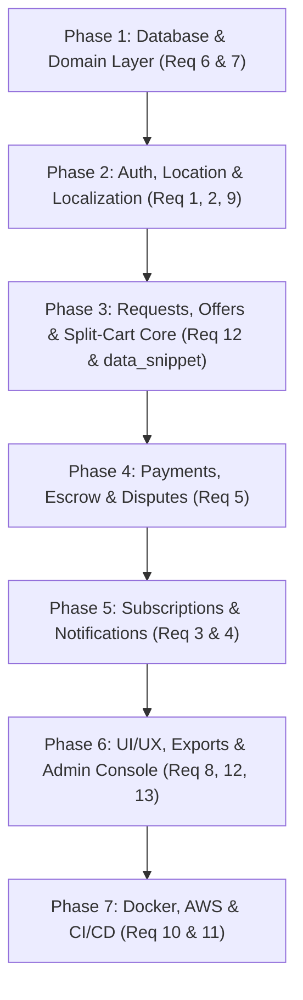

# Parts & Parcel - Project Blueprint & Implementation Plan

This implementation plan synthesizes the 13-point requirements in [requirement.txt](file:///c:/laragon/www/partsandparcel/requirement.txt), the user journey flows in [data_snippet.txt](file:///c:/laragon/www/partsandparcel/data_snippet.txt), and the reusable architectural assets from the `expiringsoon` project.

---

## 1. What We Should Borrow vs. Leave Out from ExpiringSoon

### Domain & Conceptual Comparison

| Domain Area | ExpiringSoon (`c:/laragon/www/expiringsoon`) | Parts & Parcel (`c:/laragon/www/partsandparcel`) | Decision |
| :--- | :--- | :--- | :--- |
| **Merchant Hierarchy** | Heavy multi-tenant `Store` model (branches, store logs, store academies, associations). | Peer-to-peer / Seller-to-Buyer at the `User` level (technicians, dismantlers, verified sellers, and buyers). | **Leave Out** Store monolith. User is the primary commercial actor. |
| **Cart & Order Flow** | Single store or unified marketplace cart. | **Split cart per seller** (`buyer_id`, `seller_id`) with dual options: "Checkout" or "Make Offer". | **Adapt & Customize** split-cart logic. |
| **RFQs & Negotiations** | Fixed price listings, flash deals, and promotions. | **Request $\rightarrow$ Response / Offer $\rightarrow$ Counter-Offer $\rightarrow$ Invoice** negotiation workflow. | **New Design** modeled from `data_snippet.txt`. |
| **Geo-Location & IP** | `GeoLocationTrait`, `ip-api.com` resolution, country/state/city tables, and Redis caching. | Identical requirements: IP lookup cached in Redis, profile location fallback, country-based content scoping. | **Borrow Directly**. |
| **Payments & Gateways** | `PaystackTrait`, `FlutterwaveTrait`, bank account resolution, transfer/payout APIs, and webhook handlers. | Identical gateways required: Paystack and Flutterwave for collections and seller payouts. | **Borrow Directly**. |
| **Escrow & Post-Sale** | Per-item issue reporting, automated refund calculation, dispute resolution, returns, and replacements (`refund.txt` / `order-issues.txt`). | Identical escrow principle: platform holds funds until inspection/warranty elapses; buyers report itemized issues. | **Borrow Directly**. |
| **Subscriptions** | Tiered by store limits, product counts, and advertising credits. | Tiered by **Response / Quote Limits** (how many requests a technician/seller can quote on per month). | **Borrow Architecture**, adapt quota logic to `response_limit`. |
| **Promotions & Ads** | 15+ models for CPC ads, impressions, banners, and daily ledger deductions. | Not part of the 13 requirements; unnecessary overhead. | **Leave Out**. |
| **Academy & LMS** | Learning modules, courses, and lessons for vendors. | Irrelevant to auto/tech spare parts and salvage. | **Leave Out**. |
| **Routing / Subdomains** | Subdomain-per-country (`ng.expiringsoon.com`). | Country scoping handled via session/Redis and query scopes. | **Leave Out** subdomains to avoid DNS/SSL complexity. |

---

## 2. Fleshing Out the 13 Requirements

### Requirement 1: Location Awareness
- **Logic**:
  - Middleware: `ResolveVisitorLocation`
  - Authenticated Users: Fetch active primary location from `locations` table linked to user profile.
  - Unauthenticated Visitors: Check Redis key `visitor_ip:{ip}` (TTL: 7 days).
  - Cache Miss: Query `ip-api.com` (using `stevebauman/location` or cURL fallback from `expiringsoon`), populate Redis, and store in session `current_location`.
- **Key Files**:
  - `app/Services/Location/LocationService.php`
  - `app/Http/Middleware/ResolveVisitorLocation.php`

### Requirement 2: Geography Awareness (Content Localization)
- **Scoping & Currency**:
  - Country-level isolation: Nigerian visitors see only Nigerian inventory, requests, and technicians.
  - Apply global Eloquent scope (`CountryScope`) on `Listing`, `Discussion` (Requests), and `ServiceJob`.
  - Strict local currency rule: prices stored and displayed in local currency (e.g., `NGN`, `GHS`, `KES`). No dynamic cross-currency conversions.
  - Dynamic timezone configuration based on detected country (`date_default_timezone_set`).
- **Database Tables**:
  - `countries`, `states`, `cities`, `locations`.

### Requirement 3: Push Notifications & Real-Time Broadcasting
- **Broadcasting (Reverb + Pusher fallback)**:
  - Configure `laravel/reverb` for live messaging (`MessageSent` event into `ConversationDrawer`).
  - Live offer updates (`OfferCreated`, `CounterOfferSubmitted`).
- **FCM (Firebase Cloud Messaging)**:
  - Table `device_tokens` (`user_id`, `token`, `platform`, `device_name`).
  - Notification classes queued on Redis:
    - `NewOfferNotification`
    - `OfferAcceptedNotification`
    - `InvoiceIssuedNotification`
    - `PaymentHeldInEscrowNotification`
    - `ShipmentDispatchedNotification`

### Requirement 4: Subscription Plans, Jobs, Queues & Redis Cache
- **Business Logic**:
  - Sellers and technicians subscribe to tiers (e.g., Free: 5 responses/mo; Pro: 50 responses/mo; Unlimited: unlimited responses).
  - Subscriptions track `response_limit` and count consumed responses per billing cycle.
- **Queued Jobs**:
  - `SubscriptionExpiringJob`: Alerts users 3 days prior to expiration.
  - `SubscriptionExpiredJob`: Downgrades expired accounts to free tier and marks status.
  - `SubscriptionAutoRenewJob`: Automatically attempts card charge via Paystack/Flutterwave token.
  - `SubscriptionQuotaResetJob`: Resets monthly response counters on billing cycle renewal.
- **Queues Configured**:
  - `high` (webhooks, chat messages, OTPs, push notifications).
  - `default` (invoices, emails).
  - `low` (settlement batching, abandoned cart scanning).

### Requirement 5: Payments, Escrow, Payouts, Refunds & Disputes
- **Escrow Architecture**:
  - **Payment In**: Buyer pays invoice $\rightarrow$ Webhook verifies $\rightarrow$ Funds held in platform escrow account (`Payment` marked `held_in_escrow`).
  - **Fulfillment & Warranty Window**: Seller delivers item/service $\rightarrow$ Buyer confirms receipt (or delivery tracker confirms) $\rightarrow$ Inspection & warranty period begins (e.g. 48h to 7 days).
  - **Settlement & Payout**: If no issue reported, `ReleasePaymentJob` creates `Settlement` record for seller (Gross $-$ Platform Commission). Seller initiates withdrawal $\rightarrow$ `PayoutJob` calls Paystack/Flutterwave Transfer API.
  - **Disputes & Issues (`refund.txt` flow)**:
    - Buyer reports per-item issue (`issues`, `issue_items`) with photos/evidence and requested resolution (Refund / Replacement / Return).
    - Platform automatically calculates refund amounts; vendor accepts or disputes.
    - If disputed, admin reviews evidence via Admin Dispute Console.
- **Gateways & Webhooks**:
  - `PaystackService`, `FlutterwaveService`.
  - `ConfirmPaymentJob`, `RefundPaymentJob`, `ReleasePaymentJob`, `RetryPaymentJob`.
  - Webhook controllers: `PaystackWebhookController`, `FlutterwaveWebhookController`.

### Requirement 6: Database Schema Migrations & Model Definitions
- **Audit & Migration Fixes Needed**:
  - In `2026_08_20_000004_create_community_tables.php`: Add missing `discussion_id` foreign key on `offers` table (currently references non-existent column in index line 50).
  - In `2026_08_20_000006_create_financial_tables.php`: Remove duplicate `$table->foreignId('invoice_item_id')` definition in `refund_items`.
  - In `2026_08_23_000008_create_services_table.php`: Correct `down()` to drop `service_reviews` and `service_jobs` (currently drops `shipments`).
- **Eloquent Models with Relationships**:
  - Catalog: `Category`, `Brand`, `DeviceModel`, `Item`, `Component`
  - Commercial: `Listing`, `Cart`, `CartItem`, `Wishlist`
  - RFQs & Community: `Discussion` (Request), `Response`, `Offer`, `OfferItem`, `Conversation`, `Message`
  - Financials: `Invoice`, `InvoiceItem`, `Payment`, `Settlement`, `Payout`, `PayoutSettlement`, `Refund`, `RefundItem`, `Revenue`
  - Post-Sale & Operations: `Issue`, `IssueItem`, `ReturnRequest`, `ReturnItem`, `Replacement`, `ReplacementItem`, `Dispute`, `DisputeItem`, `Shipment`, `ShipmentItem`, `ServiceJob`, `ServiceReview`
  - Subscriptions: `SubscriptionPlan`, `Subscription`

### Requirement 7: Seeding
- **Seeders**:
  - `RolesAndPermissionsSeeder` (Admin, Buyer, Seller, Service Provider / Technician).
  - `CategoriesAndBrandsSeeder` (Electronics, Phones, Laptops, Automotive parts, Salvage/Scrap categories with top brands like Apple, Samsung, Toyota, Honda, etc.).
  - `LocationsSeeder` (Countries, Nigerian States, LGAs/Cities borrowed from `expiringsoon`).
  - `SubscriptionPlansSeeder` (Starter, Pro Technician, Enterprise Dealer).
  - `DemoUsersSeeder` (Test accounts for each role).

### Requirement 8: UI/UX (Light, Dark, and System Mode)
- **Theme Configuration**:
  - Tailwind CSS `darkMode: 'class'`.
  - Alpine.js theme store managing `localStorage.theme` with system media query fallback.
  - Synchronize user theme preference to `users.theme_preference`.
  - Design aesthetic: Clean slate/zinc neutral dark palette with high-contrast accents suitable for marketplace & technical dashboards.

### Requirement 9: Authentication
- **Components**:
  - Multi-role registration & login (Buyer, Seller, Technician).
  - Password reset flows.
  - OTP phone/email verification (`tzsk/otp`) for identity verification and high-value payout transactions.
  - Session and device tracking.

### Requirement 10: CI/CD, Deployment, Docker & Testing
- **Docker Stack**:
  - `docker-compose.yml`:
    - `app` (PHP 8.4-FPM + BCMath, Redis, GD/Imagick, PCNTL, MySQL extensions)
    - `web` (Nginx with Reverb WebSocket `/app` reverse proxy)
    - `db` (MySQL 8.0)
    - `redis` (Redis 7)
    - `worker` (Queue listening on `high`, `default`, `low`)
- **Automated Testing**:
  - Feature tests covering Offer negotiation, Split-Cart checkout, Escrow release, and Webhook verification.

### Requirement 11: AWS Setup
- **Infrastructure Integrations**:
  - AWS S3 for media uploads (item images, dispute evidence, invoices).
  - AWS SES for transactional notifications.
  - Pre-signed S3 URL generation for direct client uploads.

### Requirement 12: Application Logic Completion
- **Abandoned Cart Engine**:
  - `AbandonedCartJob` scheduled hourly; identifies carts untouched for > 24 hours and triggers reminder notifications with quick-action buttons ("Checkout" or "Make Offer").
- **Invoices & Exports**:
  - `barryvdh/laravel-dompdf` for generating branded PDF invoices with escrow status badges.
  - `maatwebsite/excel` for exporting seller payout histories, transaction summaries, and admin revenue reports.

### Requirement 13: Admin Interfaces
- **Admin Management Console**:
  - Escrow & Payout Control (holdings, manual approvals, transfer status).
  - Dispute Resolution Board (view buyer evidence, seller response, issue refunds/replacements).
  - Catalog & Taxonomy Manager (Categories, Brands, Models).
  - User & Verification Management (KYC review, badge assignments).

---

## 3. Suggested Phased Execution Roadmap

### Detailed Breakdown of Execution Phases:

- **Phase 1: Database & Domain Layer (Req 6 & 7)**
  - Audit and fix syntax/foreign key bugs in existing migrations (`create_community_tables`, `create_financial_tables`, `create_services_table`).
  - Create all missing Eloquent Models with explicit relationships, fillables, and casts.
  - Create comprehensive seeders for roles, permissions, categories, brands, models, and locations.

- **Phase 2: Authentication, Location & Localization (Req 1, 2, 9)**
  - Port `GeoLocationTrait` and create `LocationService` with Redis caching.
  - Implement `ResolveVisitorLocation` middleware.
  - Setup authentication flows with OTP verification (`tzsk/otp`).

- **Phase 3: Requests, Offers & Split-Cart Flow (Req 12 & data_snippet)**
  - Implement Request (Discussion) creation with category, item checklist, and budget.
  - Implement Response & Offer creation (attaching listings or custom unlisted items/services/warranties).
  - Implement Counter-Offer negotiation lifecycle.
  - Implement Split-Cart per seller with dual paths: "Checkout" or "Make Offer".

- **Phase 4: Payments, Escrow & Disputes (Req 5)**
  - Port `PaystackTrait` and `FlutterwaveTrait` into dedicated gateway services.
  - Implement escrow lifecycle jobs (`ConfirmPaymentJob`, `ReleasePaymentJob`, `RefundPaymentJob`).
  - Implement webhook endpoints and signature validation.
  - Implement post-sale Issue & Dispute engine based on `expiringsoon/refund.txt`.

- **Phase 5: Subscriptions & Notifications (Req 3 & 4)**
  - Setup subscription tiers and response quota tracking.
  - Implement subscription cron jobs (`SubscriptionExpiringJob`, `SubscriptionExpiredJob`, `SubscriptionAutoRenewJob`).
  - Configure Reverb WebSocket broadcasting and FCM push notification services.

- **Phase 6: UI/UX Polish, Document Exports & Admin Console (Req 8, 12, 13)**
  - Implement Dark/Light/System theme switchers across layouts.
  - Build PDF invoice generation and Excel ledger exports.
  - Build Admin dashboard for escrow management and dispute arbitrations.

- **Phase 7: DevOps, Docker & AWS (Req 10 & 11)**
  - Setup `docker-compose.yml` for local and staging containerization.
  - Configure AWS S3 file storage and SES mailer.
  - Configure automated test suite and CI workflow.

---

## Confirmed Business Rules

> [!NOTE]
> **Decisions Incorporated from User Feedback:**
> 1. **Dual Checkout Payment Methods**:
>    - **Platform Escrow (`payment_method: 'platform'`)**: Platform receives and holds funds in escrow until fulfillment and warranty expiration.
>    - **Direct to Seller (`payment_method: 'direct'`)**: An invoice is still created for accounting and tracking, but no escrow or platform payout is involved (direct buyer-to-seller settlement).
> 2. **Make Offer Flow**:
>    - Clicking "Make Offer" sends an `Offer` record to the seller.
>    - Seller can accept, reject, or counter-offer with adjusted prices, warranty terms, delivery, or repair services.
>    - Once buyer accepts the finalized offer, the system automatically generates an `Invoice`.
> 3. **Warranty-Driven Escrow Release**:
>    - Escrow release timer is tied directly to the listing or offer's `warranty_period_days` (e.g. `delivered_at + warranty_period_days`). If no warranty is specified, a default grace/inspection period (e.g. 48 hours) applies.
> 4. **Admin Panel Choice**:
>    - Build lightweight, high-performance **custom Livewire 3 admin interfaces** directly inside `app/Livewire/Admin/`. This natively shares components, models, and the Alpine.js dark/light theme engine without external dependency friction.

