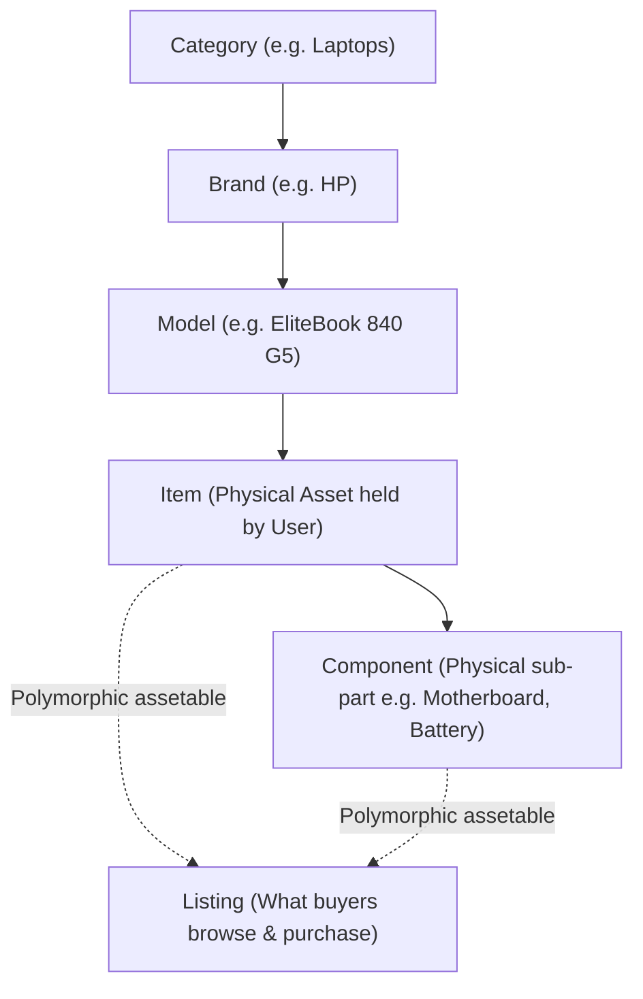
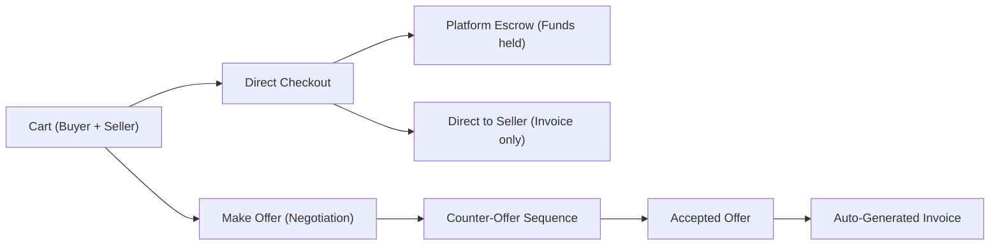
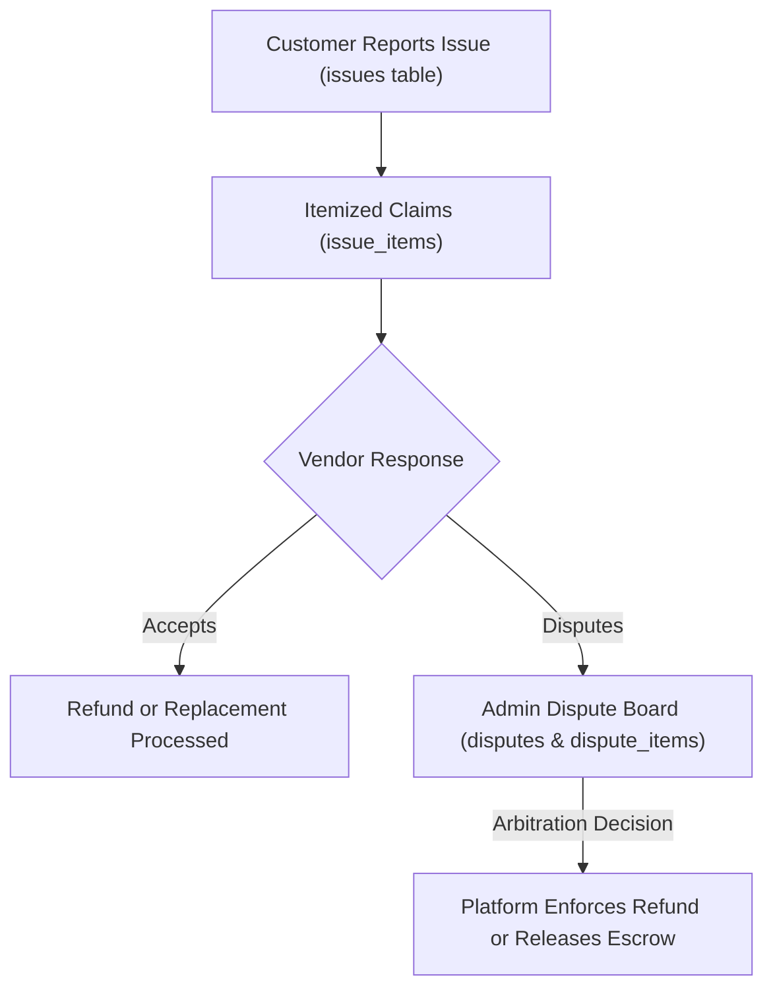

# Parts & Parcel — Master Project Context & Architectural Guide

## Purpose & Authority

This document is the definitive master architectural and operational context for the **Parts & Parcel** platform. It consolidates:
1. The original business thesis, strategic insights, and domain discussions with ChatGPT (`docs/chatgpt_full_conversation.md`).
2. The 13 core technical requirements outlined in `requirement.txt`.
3. The 7-phased execution blueprint established in `docs/PROJECT_BLUEPRINT_AND_PLAN.md`.
4. Reusable design patterns and domain models adapted from the `expiringsoon` codebase.
5. Concrete implementation decisions codified in the Laravel migrations, models, services, and Livewire components.

> [!IMPORTANT]
> The active application code and database migrations represent operational reality. When updating features, refer to this guide to maintain architectural consistency, domain terminology, and intended user workflows.

---

## 1. Product Genesis, Philosophy & Core Thesis

### Origin: From "ScrapStore" to "Parts & Parcel"
The project originated as **ScrapStore**—a marketplace initially conceived for salvaged devices and scrap parts. During deep strategic analysis, the core concept was elevated into **Parts & Parcel**: a broader, higher-leverage marketplace and community ecosystem serving physical goods (electronics, mobile devices, computing, automotive, household appliances, and heavy industrial/agricultural equipment).

### The Market Gap in African & Nigerian E-Commerce
General horizontal marketplaces (e.g. Jumia, Konga) handle commoditized retail (new consumer goods, fast fashion) but fail significantly in technical, specialized, and second-hand industries where:
- **Trust Deficit is Acute**: Buyers fear non-delivery, fake parts, non-functional components, and vanishing vendors.
- **The True Customer Experience**: Traditional marketplaces model commerce as `Browse → Cart → Pay → Deliver`. In specialized/used commerce, the critical phase where trust is won or lost is:
  $$\text{Browse} \longrightarrow \text{Cart / Offer} \longrightarrow \text{Pay (Escrow)} \longrightarrow \text{Deliver} \longrightarrow \mathbf{\text{Inspect}} \longrightarrow \mathbf{\text{Accept / Dispute}} \longrightarrow \mathbf{\text{Settle / Refund}}$$
- **"Trust is the Product"**: Parts & Parcel does not win by having the most listings; it wins by guaranteeing that transactions are protected through **neutral escrow**, **inspection periods**, **itemized dispute resolution**, and **reputation-backed service records**.

### The "Adam, Abel & Seth" Inventory Paradigm
To solve the UX confusion of selling complete items vs. spare parts, the system models the three archetypal sellers:

1. **Adam (Standard Inventory Merchant)**: Sells standard working devices (e.g., 5 brand-new HP EliteBooks, 3 used Dell Latitudes). He manages discrete quantities and prices.
2. **Abel (The Salvage / Pre-Owned Specialist)**: Holds 4 faulty laptops:
   - *Laptop 1*: Faulty screen, working motherboard $\rightarrow$ lists as a whole unit for salvage/scrap.
   - *Laptop 2*: Faulty motherboard $\rightarrow$ dismantles it and lists the screen, RAM, and battery separately.
   - *Laptop 3*: Keypad broken $\rightarrow$ lists parts individually; a customer buys the screen; Abel relists the remainder as an incomplete unit.
   - *Laptop 4*: Listed whole; a buyer makes an offer for *only* the motherboard; Abel accepts, extracts the part, fulfills the order, and re-lists the leftover chassis.
3. **Seth (The Pure Component Specialist)**: Holds bulk spare components (e.g., 50 replacement laptop batteries, 20 screens). He manages SKU-level stock.

**The Golden Architectural Rule**:
> Complete devices, spare parts, and scrap units are **NOT** three separate database systems. They are simply **three different ways of offering physical assets for sale** around a single standardized catalog hierarchy.

---

## 2. Catalog & Inventory Hierarchy

The catalog follows a strict 5-tier relational structure:

$$\mathbf{Category} \longrightarrow \mathbf{Brand} \longrightarrow \mathbf{Model} \longrightarrow \mathbf{Item} \longrightarrow \mathbf{Component}$$



### Models & Definitions:
- **`Category`**: Top-level taxonomic groups: *Electronics, Appliances, Vehicles, Equipment, Construction, Industrial, Agricultural*.
- **`Brand`**: Manufacturer or make (e.g., *Apple, HP, Toyota, Caterpillar, Samsung*).
- **`DeviceModel` (`models` table)**: Specific manufactured model line (e.g., *EliteBook 840 G5, iPhone 13, Corolla 2018*).
- **`Item`**: A specific physical asset in the possession of a user. It records physical condition, serial number, condition notes, and ownership.
- **`Component`**: A physical constituent of an `Item` (e.g., screen, engine block, logic board, compressor).
- **`Listing`**: The commercial presentation of an asset on the marketplace.
  - Linked via polymorphic relationship:
    - `assetable_type`: `App\Models\Item` or `App\Models\Component`.
    - `assetable_id`: ID of the item or component.
  - Carries pricing, currency, stock quantity, condition (`new`, `used`, `refurbished`, `for_parts`), warranty period, and location.

> [!CAUTION]
> **Prohibited Abstractions**: Never create redundant tables like `inventory_items`, `model_components`, or `asset_types`. Never expose technical terms like `assetable` or `polymorphic` in the user interface.

---

## 3. Marketplace Navigation & The 4 Contextual Tabs

When a user browses any Category, Brand, Model, or Search query, they are presented with **four distinct contextual tabs**:

| Tab | Customer Intent | What is Displayed |
| :--- | :--- | :--- |
| **Complete** | Buy working, whole goods | Fully assembled, functional devices, vehicles, and equipment. |
| **Parts** | Buy specific replacement parts | Individual components and accessories (customer-facing label is **Parts**, never "Components"). |
| **Scrap** | Buy salvageable/damaged units | Broken, incomplete, damaged, or "for parts" items ready for disassembly or component harvesting. |
| **Community** | Solicit help, requests, or quotes | Public requests for parts, local mechanic/technician recommendations, repair diagnostics, and advice. |

These tabs represent **four customer intents around the same model**, not four separate inventories.

---

## 4. User Model & Single Identity

The platform utilizes a **unified user identity** (`User` model):
- A single user account can simultaneously:
  - Buy products and negotiate offers.
  - List items, components, or scrap for sale.
  - Post requests in the community.
  - Provide quotes, repair services, or delivery.
- Role-based separation is strictly reserved for administrative governance (e.g. `super_admin`, `dispute_arbitrator`, `compliance_officer` via Spatie permissions).
- **Anti-Pattern Rejected**: Never create separate `buyers` and `sellers` tables or force users to register two distinct accounts.

---

## 5. Geolocation, Country Scoping & Content Localization

### Technical Implementation (Requirements 1 & 2):
1. **Visitor Resolution (`ResolveVisitorLocation` middleware)**:
   - **Authenticated Users**: Primary address loaded from the user's `locations` profile.
   - **Unauthenticated Visitors**: Client IP resolved against `ip-api.com` and cached in Redis with a 7-day TTL (`visitor_ip:{ip}`).
2. **Country Scoping (`CountryScope`)**:
   - Listings, Community Requests (`discussions`), and Service Jobs are isolated by country.
   - A visitor in Nigeria only sees Nigerian listings, sellers, and community posts.
3. **Currency Rule**:
   - Prices are stored and displayed strictly in the country's local currency (e.g., `NGN`, `USD`, `GHS`).
   - **No dynamic currency conversion**: Avoid displaying fluctuating converted amounts that create billing discrepancies.

---

## 6. Cart, Split-Cart & Dual-Track Checkout

### Split-Cart Architecture:
Because Parts & Parcel connects decentralized peer-to-peer sellers, salvage yards, and technicians:
- Carts are partitioned by seller: each `cart` record represents items for a specific `(buyer_id, seller_id)` pair.
- A buyer with items from two different sellers interacts with two separate seller cart groups.



### Dual Checkout Payment Tracks:
1. **Platform Escrow (`payment_method = 'platform'`)**:
   - Buyer pays into the platform's Paystack/Flutterwave escrow account.
   - Funds are held until delivery is confirmed and the inspection/warranty window elapses.
2. **Direct to Seller (`payment_method = 'direct'`)**:
   - For local physical pickup or cash-on-delivery arrangements.
   - An invoice is generated for bookkeeping, but platform escrow holding and payout jobs are bypassed.

---

## 7. Community & Requests for Quotes (RFQs)

The Community domain enables buyers and technicians to solve problems when a part isn't listed in the catalog:

$$\mathbf{Discussion} \text{ (Request)} \longrightarrow \mathbf{Responses} \longrightarrow \mathbf{Offers} \longrightarrow \mathbf{Invoice}$$

- **`Discussion`**: Public post categorized by intent (`item_request`, `service_request`, `delivery_request`, `advice`). Includes category, target model, description, budget, and location.
- **`Response`**: Public reply by a vendor or community member offering help, photos, or specs. Consumes 1 unit of the seller's monthly subscription quota.
- **`Offer`**: A private or targeted commercial bid stemming from the response.

---

## 8. Negotiation, Offers & Commercial State Machine

An `Offer` represents a negotiated proposal, **not** a simple discount code.

### Attributes:
- Parties: `sender_id` and `recipient_id` (flexible: buyer-seller, customer-repairer, requester-transporter).
- Origin: Can originate from a cart (`cart_id`) or community response (`response_id`).
- Line Items (`offer_items`):
  - `listing_id`: Nullable (allows quoting unlisted services, custom labor, or delivery).
  - `description`, `quantity`, `unit_price`, and custom `warranty_period_days`.
- Discount: Calculated at the **Offer level**, not per item.

### State Transition Lifecycle:
$$\text{Pending} \longleftrightarrow \text{Countered} \longrightarrow \begin{cases} \mathbf{Accepted} \longrightarrow \text{Automated Invoice Generation} \\ \mathbf{Declined} \\ \mathbf{Expired} \end{cases}$$

---

## 9. Billing, Invoices & Financial Ledger

Invoices are the immutable commercial and legal records of transactions.

### Key Financial Models:
- **`Invoice`**: Relates `buyer_id`, `seller_id`, optional `cart_id`, and `offer_id`. Tracks subtotal, tax, delivery fee, discount, total, and payment status (`unpaid`, `paid`, `held_in_escrow`, `settled`, `refunded`).
- **`InvoiceItem`**: Uses polymorphic `itemable` (`Listing`, `ServiceJob`, `ShipmentItem`). Stores item snapshot, unit price, quantity, and warranty terms.
- **`Payment`**: Records gateway transactions (Paystack/Flutterwave reference, channel, fees, escrow status).
- **`Revenue`**: Platform commission earned upon transaction settlement.
- **`Settlement`**: Net funds due to seller/provider after platform fee deduction, awaiting payout.
- **`Payout` & `PayoutSettlement`**: Batched disbursement records transferring funds to seller bank accounts via transfer APIs.

---

## 10. Escrow Lifecycle, Warranty & Payout Release

```mermaid
sequenceDiagram
    autonumber
    actor Buyer
    actor Seller
    participant Platform as Parts & Parcel Escrow
    participant Gateway as Paystack / Flutterwave

    Buyer->>Gateway: Pays Invoice
    Gateway-->>Platform: Webhook (charge.success)
    Platform->>Platform: Mark Payment 'held_in_escrow'
    Seller->>Buyer: Dispatches / Delivers Goods
    Buyer->>Platform: Confirms Delivery (or Courier Tracking confirms)
    Note over Platform: Inspection / Warranty Window Starts (e.g. 48h to 7 days)
    alt No Issue Reported
        Platform->>Platform: ReleasePaymentJob executes
        Platform->>Seller: Settlement created & Payout initiated
    else Issue Reported
        Platform->>Platform: Freeze Escrow; Issue/Dispute opened
    end
```

- **Release Countdown**: Default grace inspection period is **48 hours** (or the explicit `warranty_period_days` agreed upon in the offer/listing).
- **Auto-Release**: If the buyer fails to confirm or report an issue within the warranty window after verified delivery, escrow funds automatically unlock.

---

## 11. Logistics & Shipments

### Three Delivery Responsibility Modes:
1. **Buyer Responsible**: Buyer picks up locally or creates a community delivery request to hire a transporter.
2. **Seller Responsible**: Seller handles logistics directly (own vehicle or contracted courier); tracking info attached to the shipment.
3. **Platform Responsible**: Future integrated carrier booking.

### Shipment Architecture:
- Uses `sender_id` and `receiver_id`.
- Contains immutable address snapshots from `locations` to preserve historical integrity.
- Has many `shipment_items` referencing invoice line items.

---

## 12. Services, Repairs & Maintenance

Parts & Parcel natively supports technical labor (installation, diagnostics, repairs):
- **`ServiceJob`**:
  - Links customer and technician.
  - Linked `item_id` is **nullable**—supports repairs of items purchased on the platform, registered user assets, or external items brought in by the customer.
  - Carries scheduled dates, completion status, location, notes, and agreed service warranty.
- **`ServiceReview`**:
  - Verified post-service feedback displayed on the technician's public profile to build trade reputation.

---

## 13. Trust, Issues, Disputes & Resolutions

Post-sale problem resolution follows the itemized resolution engine:



- **Itemized Claims**: A buyer with 3 items in an order can dispute *one* defective part while accepting the other two.
- **Resolution Options**: `refund`, `replace`, `return_and_refund`.
- **Evidence**: Photos, video recordings, and chat logs are stored in `evidence` and linked to disputes.

---

## 14. Subscriptions, Plans & Response Quota Engine

- **Business Model**: Monetizes commercial sellers and service technicians.
- **Quota Mechanics**:
  - Plans define a monthly `response_limit` (e.g. Starter: 10 responses/mo; Pro: 50; Enterprise: Unlimited).
  - Quota is decremented when replying to Community requests.
- **Scheduled Background Jobs**:
  - `SubscriptionExpiringJob`: Runs daily; notifies users 3 days prior to plan expiry.
  - `SubscriptionExpiredJob`: Downgrades expired accounts to Free tier upon grace period lapse.
  - `SubscriptionAutoRenewJob`: Re-charges saved gateway authorization tokens.

---

## 15. Messaging, Real-Time Broadcasting & Notifications

- **Real-Time WebSockets**: Powered by **Laravel Reverb** (with Pusher protocol compatibility). Channels:
  - Private user notification channels: `private-App.Models.User.{id}`.
  - Conversation channels for live negotiation and chat drawers: `private-conversation.{id}`.
- **Push Notifications (FCM)**:
  - Mobile & desktop push via Firebase Cloud Messaging.
  - Device registration via `device_tokens` table.
- **UI Presentation Rule**:
  - **Desktop**: Fast slide-over conversation drawer (`ConversationDrawer`) with button to open full thread.
  - **Mobile**: Navigates directly to the dedicated full-screen message page (`MessageConversation`) to optimize limited screen real estate.

---

## 16. Background Jobs, Queues & Scheduled Tasks

Queues run on Redis and are partitioned by priority:
- `high`: Webhook processing, chat messages, OTP delivery, push notifications.
- `default`: Invoices, order state transitions, emails.
- `low`: Daily settlement batching, `AbandonedCartJob` (scans carts untouched > 24 hours).

---

## 17. Admin Console & Platform Operations

Custom Livewire 3 administrative interfaces (`app/Livewire/Admin/`):
- **Escrow Governance**: Overview of funds held in escrow, pending releases, and fee yields.
- **Dispute Board**: Multi-party review showing customer claims, vendor responses, inspection photos, and one-click dispute resolution.
- **Catalog Management**: Dynamic editor for Categories, Brands, and Device Models.
- **KYC & Verification**: Approving registered vendors and verified mechanics.

---

## 18. UI/UX, Themes & Layout Systems

### Layout Partitioning:
1. **Marketplace Layout (`layouts/app.blade.php`)**: Public storefront, search, browse, category pages, community board, cart, and product details.
2. **Dashboard Layout (`layouts/dash.blade.php`)**: Authenticated control center with unified sidebar (Overview, Offers, Invoices, Shipments, Locations, Messages, Subscriptions).

### Theme Engine:
- Built with Tailwind CSS `darkMode: 'class'`.
- Alpine.js reactive store managing `localStorage.theme` with fallback to system preferences (`prefers-color-scheme`).

---

## 19. Cloud Infrastructure, Docker & CI/CD Pipeline

- **Containerization**:
  - `Dockerfile`: Multi-stage build with PHP 8.4-FPM, Nginx, Composer, Node/Vite, BCMath, Redis, GD, and PCNTL.
  - `docker-compose.yml`: Local & staging orchestration for `app`, `web`, `db` (MySQL 8), `redis`, and `worker`.
- **Kubernetes Ready**: Production manifests in `k8s/` (`deployment-app.yaml`, `deployment-worker.yaml`, `service.yaml`, `ingress.yaml`, `hpa.yaml`, `configmap.yaml`).
- **AWS Cloud Stack**:
  - **S3**: Media storage for item photos and dispute evidence.
  - **SES**: Transactional notification emails.
  - **RDS**: Managed MySQL database.
  - **ElastiCache**: Redis for caching, sessions, and queue management.
- **CI/CD Pipeline**: GitHub Actions (`.github/workflows/ci.yml` & `deploy.yml`) testing, linting, building, and deploying upon push to `main`.

---

## 20. Execution Roadmap & Current Status

| Phase | Description | Key Modules | Status |
| :--- | :--- | :--- | :--- |
| **Phase 1** | Database & Domain Foundation | Catalog hierarchy, migrations, Eloquent models, seeders. | Completed |
| **Phase 2** | Auth, Location & Localization | IP-API, Redis geolocation cache, country scoping, OTP auth. | Completed |
| **Phase 3** | Requests, Offers & Split-Cart | Community RFQs, offer negotiation, split-cart per seller. | Completed |
| **Phase 4** | Payments, Escrow & Disputes | Paystack/Flutterwave escrow, release jobs, issue engine. | Completed |
| **Phase 5** | Subscriptions & Notifications | Response quotas, subscription cron jobs, Reverb, FCM. | Completed |
| **Phase 6** | UI/UX, Exports & Admin Console | Admin dashboard, PDF invoice generator, Excel ledger exports. | Completed |
| **Phase 7** | Docker, Testing, CI/CD & AWS | Multi-stage Docker, GitHub Actions, AWS architecture guide. | Completed |

---

## 21. Architectural Rules & Anti-Patterns Reference

1. **Do not create redundant inventory abstractions**: Use `Item` and `Component` with polymorphic `Listing`.
2. **Do not duplicate user tables**: Keep a single `User` identity across buying, selling, and services.
3. **Offers are proposals; Invoices are commercial records**: Never conflate negotiation state with billing state.
4. **Offer discounts are at offer level; Invoice discounts are at invoice level**.
5. **No artificial currency conversions**: Keep transactions strictly in the country's local currency.
6. **Preserve historical transaction meaning**: Copy agreed warranties, prices, and address snapshots into invoices and shipments; never rely on mutable relations for historical data.
7. **Trace full workflow before modifying schema**: Before adding a table or foreign key, trace how it affects cart, checkout, escrow, delivery, and dispute flows.
