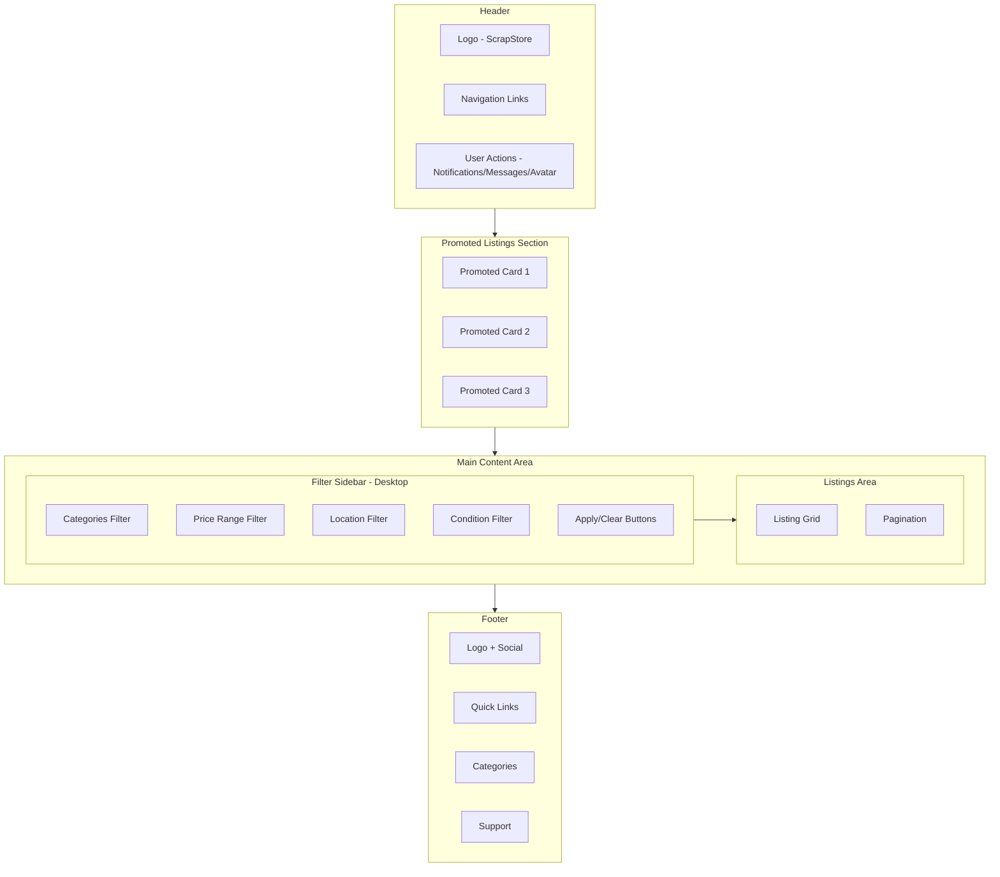
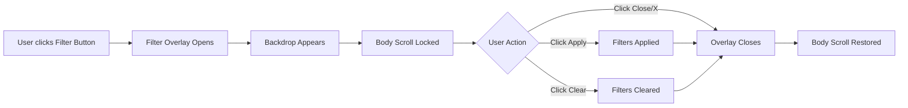

# Browse Page Implementation Plan

## Overview
Create a browse page (`browse.html`) for ScrapStore that displays listings with filtering capabilities, promoted listings section, and pagination. The page will maintain the same styling, header, and footer as the index page.

## Page Structure

```
┌─────────────────────────────────────────────────────────────┐
│                        HEADER                               │
│  (Same as index.html - Logo, Nav, User Actions)            │
├─────────────────────────────────────────────────────────────┤
│                  PROMOTED LISTINGS SECTION                  │
│  (Ad section with sponsored/featured listings)              │
├─────────────────────────────────────────────────────────────┤
│  ┌────────────┐ ┌────────────────────────────────────────┐  │
│  │            │ │                                        │  │
│  │   FILTER   │ │           LISTINGS GRID               │  │
│  │  SIDEBAR   │ │                                        │  │
│  │            │ │   ┌─────┐ ┌─────┐ ┌─────┐ ┌─────┐    │  │
│  │ - Categories│ │   │Card │ │Card │ │Card │ │Card │    │  │
│  │ - Price    │ │   └─────┘ └─────┘ └─────┘ └─────┘    │  │
│  │ - Location │ │                                        │  │
│  │            │ │   ┌─────┐ ┌─────┐ ┌─────┐ ┌─────┐    │  │
│  │            │ │   │Card │ │Card │ │Card │ │Card │    │  │
│  │            │ │   └─────┘ └─────┘ └─────┘ └─────┘    │  │
│  │            │ │                                        │  │
│  │            │ ├────────────────────────────────────────┤  │
│  │            │ │           PAGINATION                   │  │
│  └────────────┘ └────────────────────────────────────────┘  │
├─────────────────────────────────────────────────────────────┤
│                        FOOTER                               │
│  (Same as index.html)                                       │
└─────────────────────────────────────────────────────────────┘
```

## Component Details

### 1. Header Section
- Copy exact header from index.html (lines 136-160)
- Includes: Logo, Navigation, Notification/Message icons, User avatar
- Sticky positioning with `sticky top-0 z-50`

### 2. Promoted Listings Section
**Desktop View:**
- Full-width section with gradient background (similar to hero styling)
- Horizontal scrollable carousel or 3-4 card grid
- "Sponsored" or "Promoted" badge on each listing
- Slightly different background color to distinguish from regular listings

**Mobile View:**
- Horizontal scrollable cards
- Compact card design

**Content:**
- 3-4 promoted listing cards
- Same card structure as regular listings but with "Promoted" badge
- Eye-catching styling to draw attention

### 3. Main Content Layout

**Desktop (lg and above):**
- Two-column layout: Sidebar (25%) + Listings (75%)
- Flexbox or CSS Grid layout

**Mobile/Tablet:**
- Single column layout
- Filter button fixed at top of listings
- Sidebar becomes overlay when filter button clicked

### 4. Filter Sidebar

**Desktop:**
- Always visible on the left
- Sticky positioning while scrolling
- Sections:
  - **Categories** - Checkbox list with part counts
    - Smartphones
    - Laptops
    - Tablets
    - Wearables
    - Gaming
    - Other
  - **Price Range** - Dual range slider or input fields
    - Min/Max inputs
    - Visual slider
  - **Location** - Search/dropdown for location filter
    - Text input with location icon
    - Distance radius selector
  - **Condition** - Radio buttons
    - New
    - Used
    - Repaired
  - **Apply Filters Button**
  - **Clear Filters Link**

**Mobile Overlay:**
- Slides in from left to right
- Full-height overlay with semi-transparent backdrop
- Close button (X) at top right
- Same filter content as desktop
- "Apply" and "Clear" buttons at bottom
- Body scroll locked when overlay open

### 5. Mobile Filter Button
- Fixed position button visible on mobile/tablet
- Shows filter icon and "Filters" text
- Badge showing number of active filters
- Opens sidebar overlay on click

### 6. Listings Grid

**Card Design (Same as index.html lines 271-458):**
```html
<div class="bg-white border border-gray-200 rounded-lg overflow-hidden shadow-sm hover:shadow-md transition">
  <div class="relative h-48 bg-gray-200">
    
    <span class="absolute top-2 right-2 bg-green-500 text-white text-xs font-bold px-2 py-1 rounded">New</span>
  </div>
  <div class="p-4">
    <div class="flex justify-between items-start mb-2">
      <h3 class="font-medium text-gray-900">Product Name</h3>
      <span class="font-bold text-gray-900">$XX.XX</span>
    </div>
    <p class="text-sm text-gray-600 mb-3">Description</p>
    <div class="flex items-center justify-between">
      <div class="flex items-center">
        <div class="w-6 h-6 rounded-full bg-gray-200 flex items-center justify-center mr-2">
          <i class="ri-user-line text-gray-600 ri-sm"></i>
        </div>
        <span class="text-xs text-gray-600">Seller Name</span>
      </div>
      <button class="bg-primary text-white px-3 py-1 rounded-button text-sm font-medium whitespace-nowrap">Buy Now</button>
    </div>
  </div>
</div>
```

**Grid Layout:**
- Desktop (xl): 4 columns
- Desktop (lg): 3 columns
- Tablet (md): 2 columns
- Mobile: 1 column

**Listing Count:**
- Show 8-12 listings per page
- Total count display: "Showing 1-12 of 156 results"

### 7. Pagination Component

**Design:**
```
← Previous  1  2  3  ...  10  Next →
```

**Features:**
- Previous/Next buttons with arrows
- Page numbers (show 5 at a time)
- Current page highlighted with primary color
- Ellipsis for large page counts
- Disabled state for Previous on first page / Next on last page

**Mobile:**
- Compact version: `← 1 of 10 →`
- Or: `← Previous  Next →` with page indicator

### 8. Footer Section
- Copy exact footer from index.html (lines 569-632)
- Includes: Logo, Quick Links, Categories, Support, Social icons, Copyright

### 9. JavaScript Functionality

**Mobile Filter Toggle:**
```javascript
// Open filter overlay
function openFilterOverlay() {
  document.getElementById('filterOverlay').classList.add('active');
  document.body.style.overflow = 'hidden';
}

// Close filter overlay
function closeFilterOverlay() {
  document.getElementById('filterOverlay').classList.remove('active');
  document.body.style.overflow = '';
}
```

**Pagination:**
```javascript
// Handle page change
function changePage(page) {
  // Update active page styling
  // Could trigger content reload in real implementation
}
```

**Filter Interactions:**
- Checkbox/radio state management
- Price range slider functionality
- Apply/Clear filters actions

## Responsive Breakpoints

| Breakpoint | Layout |
|------------|--------|
| Mobile (<640px) | Single column, filter overlay |
| Tablet (640-1024px) | 2-column grid, filter overlay |
| Desktop (>1024px) | Sidebar + 3-4 column grid |

## Color Scheme (from index.html)

| Element | Color |
|---------|-------|
| Primary | #4f46e5 |
| Secondary | #10b981 |
| Background | #f9fafb |
| Card Background | #ffffff |
| Text Primary | #1f2937 (gray-900) |
| Text Secondary | #4b5563 (gray-600) |
| Border | #e5e7eb (gray-200) |
| Badge - New | #22c55e (green-500) |
| Badge - Used | #eab308 (yellow-500) |
| Badge - Repaired | #3b82f6 (blue-500) |

## File Structure

```
ScrapStore/
├── index.html
├── browse.html (NEW)
├── images/
│   └── ... (existing images)
└── plans/
    └── browse-page-plan.md
```

## Implementation Steps

1. **Create browse.html base structure**
   - Copy head section with all styles and scripts from index.html
   - Update page title to "Browse - ScrapStore"

2. **Add Header**
   - Copy header HTML from index.html
   - Update "Browse" nav link to active state

3. **Create Promoted Listings Section**
   - Design promoted listings container
   - Add 3-4 promoted listing cards
   - Style with distinct background

4. **Build Main Content Layout**
   - Create flex/grid container for sidebar + listings
   - Add responsive classes

5. **Implement Filter Sidebar**
   - Categories section with checkboxes
   - Price range with slider
   - Location input
   - Condition radio buttons
   - Apply/Clear buttons

6. **Create Mobile Filter Overlay**
   - Overlay container with backdrop
   - Slide-in animation
   - Close button
   - Same filter content

7. **Add Listings Grid**
   - Copy card structure from index.html
   - Create 8-12 sample listings
   - Apply responsive grid classes

8. **Implement Pagination**
   - Create pagination component
   - Add active/hover states
   - Mobile responsive version

9. **Add Footer**
   - Copy footer HTML from index.html

10. **Add JavaScript**
    - Mobile filter toggle
    - Overlay close functionality
    - Basic pagination interaction

## Mermaid Diagram - Page Layout Flow



## Mermaid Diagram - Mobile Filter Flow



## Notes

- All styling uses Tailwind CSS classes (same CDN as index.html)
- Icons use Remix Icon library (same as index.html)
- Fonts: Inter for body, Pacifico for logo
- Maintain consistent spacing and border-radius values
- Ensure accessibility with proper ARIA labels and keyboard navigation
